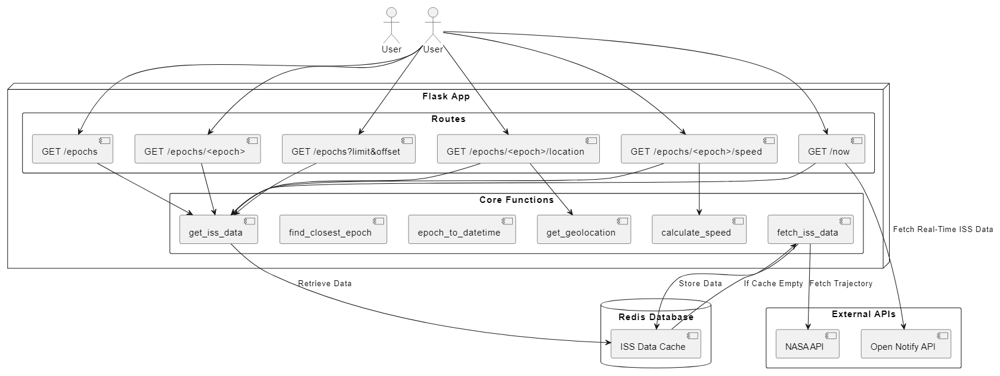

# **ISS Tracker API**

## **Overview**
The **ISS Tracker API** is a Flask-based web service that retrieves and processes real-time **trajectory data** of the **International Space Station (ISS)** from NASA's public data source. It provides insights into the ISS's position, velocity, and speed, and includes functionality to find the closest epoch to a given time.

The API allows the user to:
- Retrieve **entire ISS state vector data**.
- Query **specific epochs** of ISS position and velocity.
- Return **state variables** of any given epoch.
- Compute **instantaneous speed** at any given epoch.
- Get the ISS state **closest to the current time**.

**Data Source**: [NASA ISS Trajectory Data](https://spotthestation.nasa.gov/trajectory_data.cfm)

---

## Features
- Fetches real-time ISS trajectory data from NASA's XML API.
- Converts the **.XML file to JSON** for effective querying.
- Provides multiple **API endpoints** to retrieve ISS state vectors.
- Computes **instantaneous speed** using velocity components.
- Supports **pagination** ('limit' & 'offset' for large datasets).
- Includes **Docker File** for easy computation.

## **Requirements**
### **1. Dependencies**
This script requires the following Python packages:
- `requests` - To fetch ISS trajectory data from NASA's API.
- `xmltodict` - To parse XML response data.
- `math` - To perform speed calculations.
- `logging` - To log messages for debugging and tracking.
- `datetime` - For timestamp conversion and calculations.
- `flask` - For running Flask API.
- `pytest` (for unit testing)

Install dependencies using:
```
pip install requests xmltodict math logging datetime flask pytest
```
This is used for the XML Data File

## **Usage**
### **Running via Docker**
A `Dockerfile` is included to allow the Flask API to run in a containerized environment.
#### **Building the Container (Docker Image)**
```
docker build --no-cache -t iss_tracker .
```
Units Tests are run when the Container is Built (--no-cache ensures pytest output is shown)

#### **Running the Flask API in a Container**
Run the following Python script:
```
docker run -p 5000:5000 iss_tracker
```
Your Server should be running.

Next, you can open a new terminal and log into where the files are. Then use the following Flask API Endpoints and Example Code to analyze data.

## **Flask API Endpoints**
| **Routes**                      | **Method**  | **Description**                                        | **Example Code**                                                   |
|---------------------------------|-------------|--------------------------------------------------------|--------------------------------------------------------------------|
| `/epochs`                       | **GET**     | Returns the **entire dataset** of ISS state vectors.   | `curl https://localhost:5000/epochs`                               |
| `/epochs?limit=int&offset=int`  | **GET**     | Returns **paginated results** (limit & offset).        | `curl https://localhost:5000/epochs?limits=5&offset=2`             |
| `/epochs/<epoch>`               | **GET**     | Returns **state vector** for a given epoch.            | `curl https://localhost:5000/epochs/2025-045T12:00:00.000Z`        |
| `/epochs/<epoch>/speed`         | **GET**     | Returns **instantaneous speed** at a given epoch.      | `curl https://localhost:5000/epochs/2025-045T12:00:00.000Z/speed`  |
| `/now`                          | **GET**     | Returns **closest epoch to current time** with speed.  | `curl https://localhost:5000/now`                                  |

## **Functions**
### `get_iss_data() -> List[Dict[str, Any]]`
Retrieves and parses ISS trajectory data from NASA's API.

### `calculate_speed(x_dot: float, y_dot: float, z_dot: float) -> float`
Computes the speed of the ISS using Cartesian velocity components.

### `epoch_to_datetime(epoch_str: str) -> datetime`
Converts an ISS epoch timestamp to a Python `datetime` object.

### `find_closest_epoch(data: List[Dict[str, Any]], target_time: datetime) -> Dict[str, Any]`
Finds the state vector closest to a given timestamp.

### `get_data_stats(data: List[Dict[str, Any]]) -> Tuple[Dict[str, Any], Dict[str, Any], float, float]`
Computes the first and last epochs, average speed, and current speed.

## **Testing**
The script includes a unit test file `test_iss_tracker.py`, which tests core functionalities using `pytest`.

## **Example Output**
The following display some sample requests and their respective output:
```
Request: curl http://localhost:5000/epochs/"2025-074T11:58:54.000Z"
Output:
"epoch": "2025-074T11:58:54.000Z",
  "x": 4638.50967061093,
  "x_dot": -3.10239546117154,
  "y": 4923.49202146089,
  "y_dot": 3.65439585849351,
  "z": -611.975207675823,
  "z_dot": 5.98179479415363

Request: curl http://localhost:5000/epochs/"2025-074T11:58:54.000Z"/speed
Output:
"epoch": "2025-074T11:58:54.000Z",
  "speed_km_s": 7.66559427881725

Request: curl http://localhost:5000/now
Output:
"current_state": {
    "epoch": "2025-063T10:38:30.000Z",
    "x": 1996.24794417011,
    "x_dot": 4.46867852495624,
    "y": -6496.35831735636,
    "y_dot": 1.59149019181892,
    "z": -241.393686237859,
    "z_dot": -6.01045329554794
```

## **Cleaning Up Container**
Once completed with your usage of the created container don't forget to stop and remove it.

The following code lets you view the **Container ID** of Docker Images:
`docker ps -a`

Then you can stop a specific container by:
`docker stop <Container ID>`

Finally, once the container is stopped you can remove it with:
`docker rm <Container ID>`

## Software Diagram
This diagram illustrates the process of a NASA ISS Tracker analysis using Flask API, showing the relationships between the Docker container, which runs the API, and its dependencies. Inside the container, there is the API Code (iss_tracker.py) which manages the ISS data retrieval and data analysis. The user interacts with the system by retrieving API responses and test results.


### AI Assisted Development
AI tools played a role in determining Unit Tests for the program and error-solving/research for certain code programs. AI was used as a resource to expand knowledge and allow clarity in certain regions. All code was reviewed and analyzed for quality and accuracy if it happened to have assistance from AI.


